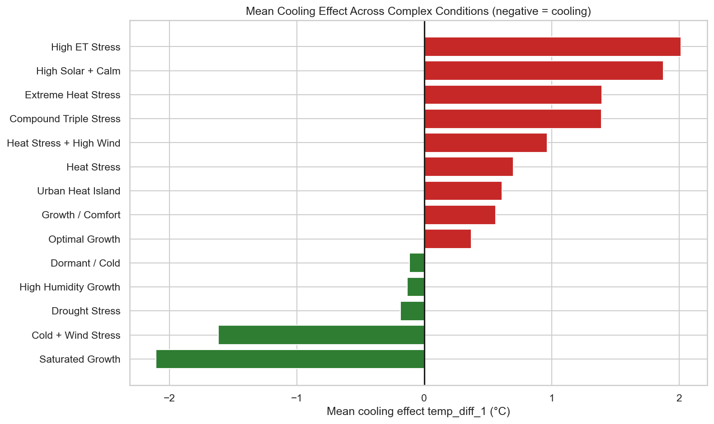
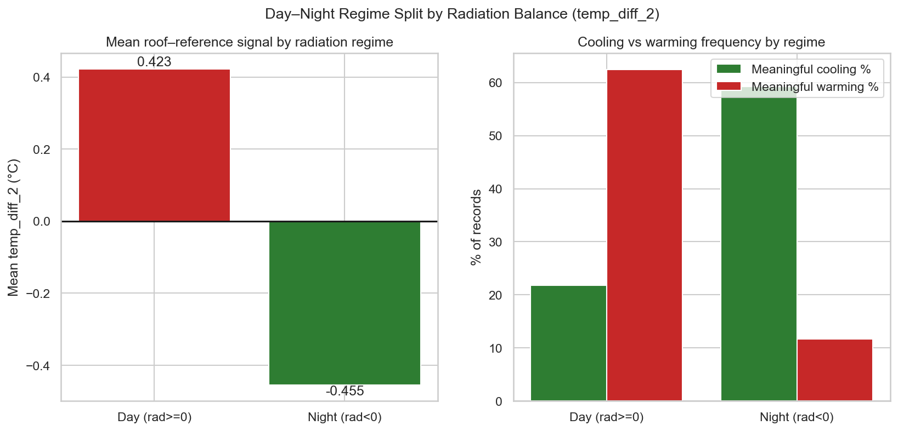
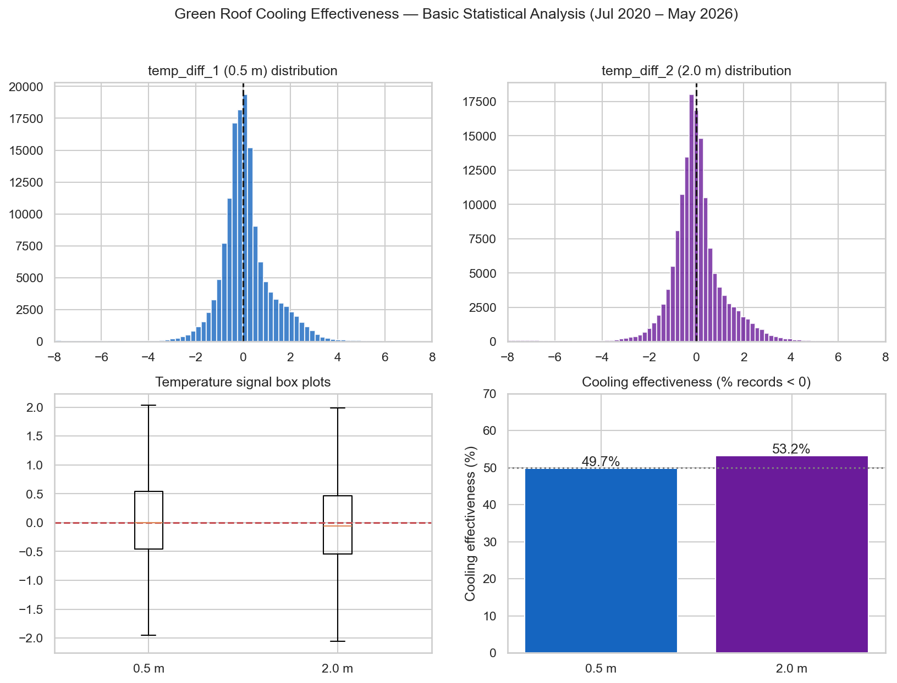
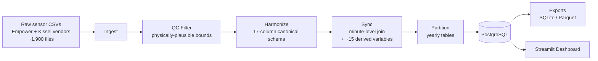
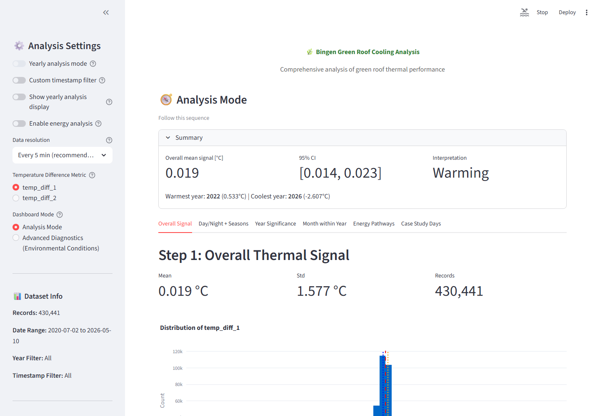
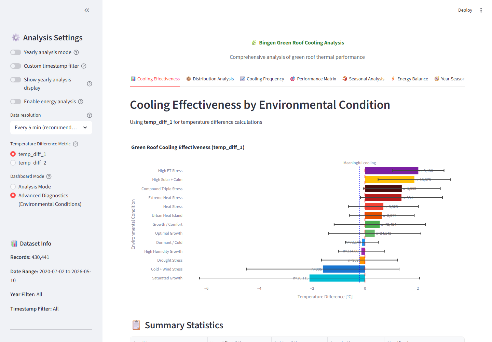
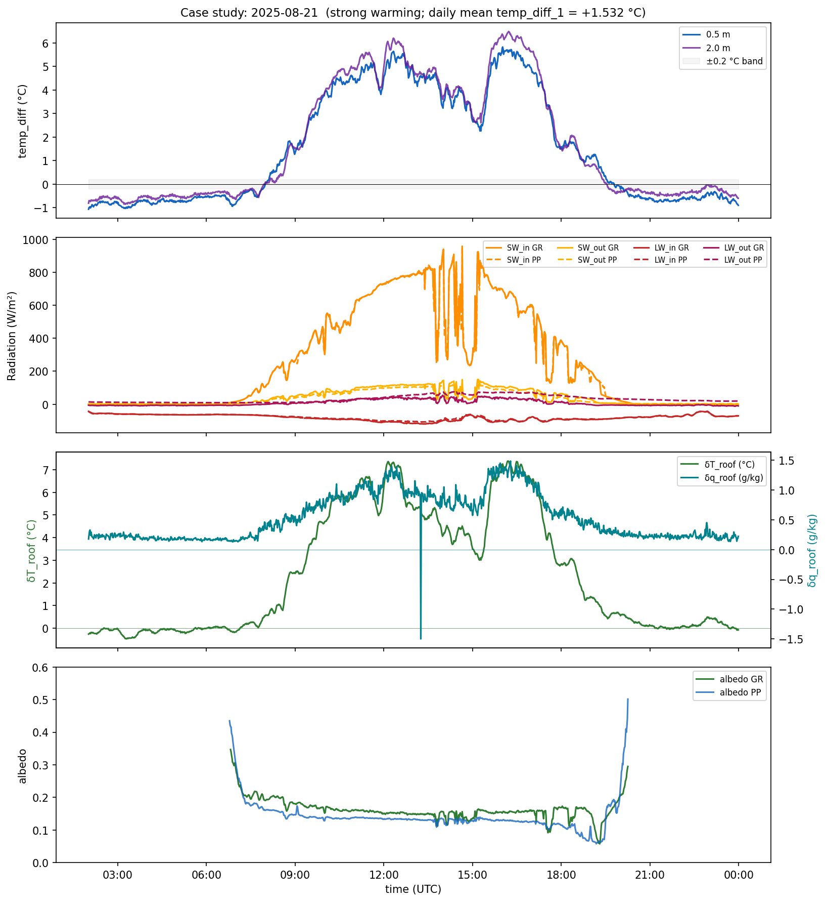

# Bingen Green Roof Microclimate Pipeline

**Does a green roof actually cool a building down?** A 6-year, multi-vendor sensor pipeline and statistical analysis of a real green roof says: it depends — and the answer reverses between day and night.

[](https://www.python.org/)
[](https://streamlit.io/)
[](https://www.postgresql.org/)
[](LICENSE)



## The Question

Green roofs are widely promoted as an urban heat island mitigation strategy, but most performance claims rest on short field campaigns or simulations. This project asks a narrower, harder question with real multi-year field data: **does a semi-intensive green roof at TH Bingen (Bingen am Rhein, Germany) measurably cool the local microclimate compared to an adjacent parking lot — and if so, under what conditions?**

Two weather stations — one on the green roof, one over a parking lot reference surface — have logged radiation, temperature, humidity, wind, and soil sensors since 2020, across two different vendor systems. This pipeline turns six years of that raw, messy sensor output — 2.15M+ minute-level records — into a single synchronized dataset and a statistically rigorous answer.

Answering it required building a full data-engineering pipeline — ingestion, quality control, multi-vendor schema harmonization, and derived-variable engineering in SQL — then applying non-parametric hypothesis testing (Mann-Whitney U, Kruskal-Wallis) and effect-size analysis across day/night, seasonal, and multi-year splits to determine not just whether the roof cools, but when, by how much, and under which conditions.

## Key Finding: The Effect Reverses at Night

As of the most recent full analysis run (Jul 2020 – May 2026, **2,151,417 synchronized minute-level observations**), the roof does not simply run cooler than the parking lot — its effect flips depending on radiation regime:

| | Mean effect vs. parking lot | Share of records |
|---|---|---|
| **Night** (net radiation < 0) | **−0.455 °C** | 59.3% show meaningful *cooling* |
| **Day** (net radiation ≥ 0) | **+0.423 °C** | 62.4% show meaningful *warming* |

The day/night split is not noise — a Mann-Whitney U test on a sample this large gives Cohen's r = 0.501 (Z = −734.6). Cooling effectiveness peaks around **21:00 (~80–82%)** and in **September (~59–64%)**, and swings from a **−2.107 °C** mean effect under "Saturated Growth" conditions to **+2.016 °C** under "High ET Stress" conditions (Kruskal–Wallis η² = 0.142 across 14 condition regimes). In other words: whether the roof helps or hurts depends on exactly the kind of weather-and-plant-state interaction that a single-season study would miss.




## How It Works

Raw CSVs from two independent sensor vendors are cleaned, harmonized onto a shared schema, joined minute-by-minute, and enriched with derived micrometeorological variables — all in a repeatable, resumable pipeline.



Each stage earns its place:

- **Ingest / QC Filter** — raw sensor feeds are not trustworthy at face value. Filtering against physically plausible bounds caught soil-moisture readings up to 60,605 and a temperature channel reporting −45,507 °C, both scaling artifacts from the logging hardware (see `outputs/greenroof_qc_shortlist.md`).
- **Harmonize** — the two vendor systems (Empower, Kissel) name and structure their columns differently. Both are mapped onto one canonical 17-column schema per site so downstream logic doesn't need to know which vendor a given record came from.
- **Sync** — a minute-level aggregated join across both sites, computing ~15 derived variables in SQL: temperature differentials at two heights, net radiation balance, albedo, Magnus-formula specific humidity gradients, and Stefan-Boltzmann surface energy terms.
- **Partition** — the synchronized table is split into yearly child tables for query performance at scale.

## Scale & Engineering

- **2.15M+ synchronized records**, minute-level resolution, spanning **6 years** (Jul 2020 – May 2026)
- **~1,900 raw CSV files** ingested from **2 independent vendor sensor systems**
- Yearly table partitioning for query performance on a multi-million-row analytics table
- Export scripts to **SQLite** and **Parquet** (the latter DuckDB-accelerated) decouple downstream analysis from a live PostgreSQL connection — schema reference in [`instructions/DATASET_ACCESS_GUIDE.md`](instructions/DATASET_ACCESS_GUIDE.md)
- CLI orchestrator (`scripts/run_pipeline.py`) supporting stage ranges, dry-runs, and verbose logging for operational control
- A recurring **monthly update workflow** (`scripts/run_monthly_update.py`) that dry-runs, executes, verifies, and re-aggregates on new data automatically

## Interactive Dashboard

A Streamlit app (`dashboard/app.py`, `dashboard/analysis.py`) exposes the full analysis interactively, in two modes:

- **Guided mode** — a 6-step narrative walkthrough (overall signal → day/night/seasonal split → year-by-year significance → month progression → energy pathways → case studies), built for someone with no background in the dataset.
- **Advanced mode** — 11 tabs for open-ended exploration: cooling effectiveness, distributions, frequency analysis, performance matrix, seasonal variation, energy balance, year/season/day-night signal, evapotranspiration diagnostics, albedo/net radiation, growing-vs-cold period comparison, and case-study days.

| Guided mode | Advanced mode |
|---|---|
|  |  |

```bash
streamlit run dashboard/app.py
```

## Case Study Deep Dive

Beyond the aggregate statistics, the pipeline generates single-day diagnostic panels — temperature differential, four-component radiation balance, energy/humidity gradients, and albedo — to inspect exactly what drives an unusually strong warming or cooling day.



## Tech Stack

**Data engineering:** Python 3.11 · PostgreSQL · SQLAlchemy · psycopg2 · DuckDB · Parquet/PyArrow · SQLite
**Analysis:** pandas · NumPy · SciPy (Mann-Whitney U, Kruskal-Wallis, Spearman)
**Visualization:** Streamlit · Plotly · Matplotlib · Seaborn

## Reproducibility

This repo ships the full pipeline and dashboard source code, plus pre-computed results (the figures and statistics above) from the real 6-year dataset — it is **not** currently a one-click "clone and run" project:

- **Raw sensor data is not published.** The CSVs are private field-research data from TH Bingen's monitoring stations and are excluded via `.gitignore`.
- **The dashboard requires your own PostgreSQL instance.** `dashboard/analysis.py` connects directly to Postgres — there's no bundled SQLite/Parquet fallback shipped with the repo, so reproducing the pipeline end-to-end needs an equivalent multi-vendor sensor dataset and a configured `config/.env`.

Without any setup, you can still read the pipeline/SQL/statistics code directly and see real analysis output throughout this README.

## Quick Start

```bash
# 1. Environment
python -m venv .venv
.venv\Scripts\activate
pip install -r requirements.txt

# 2. Configure database credentials
copy config\.env.example config\.env
# edit config/.env with your PostgreSQL values

# 3. Place raw input files
#    Green roof -> data/raw/greenroof/
#    Parkplatz  -> data/raw/parkplatz/

# 4. Dry-run, then execute
python scripts/run_pipeline.py --dry-run
python scripts/run_pipeline.py

# 5. Verify, then launch the dashboard
python scripts/verify_pipeline.py
streamlit run dashboard/app.py
```

Stage control (run a single stage or range):

```bash
python scripts/run_pipeline.py --from qc-filter
python scripts/run_pipeline.py --from harmonize --to sync
```

More detail: [`instructions/QUICK_START.md`](instructions/QUICK_START.md) · [`instructions/PIPELINE_GUIDE.md`](instructions/PIPELINE_GUIDE.md) · [`instructions/DATASET_ACCESS_GUIDE.md`](instructions/DATASET_ACCESS_GUIDE.md)

## Repository Structure

```text
bingen_greenroof_pipeline/
├── pipeline/       # ETL stages: ingest, qc_filtering, harmonize, sync, partition
├── scripts/        # CLI orchestrator, verification, export, and operator scripts
├── dashboard/      # Streamlit app + analysis engine
├── config/         # settings.py, pipeline.yaml, .env.example
├── data/raw/       # raw sensor CSVs (gitignored; folder structure only)
├── outputs/        # generated figures, stats, exports (gitignored)
├── assets/readme/  # curated figures used in this README
└── instructions/   # setup and operational docs
```

## License

MIT — see [`LICENSE`](LICENSE).

## Author

**Joseph Y.E Newton** — [GitHub](https://github.com/joenewton10) · jyenewton10@gmail.com
